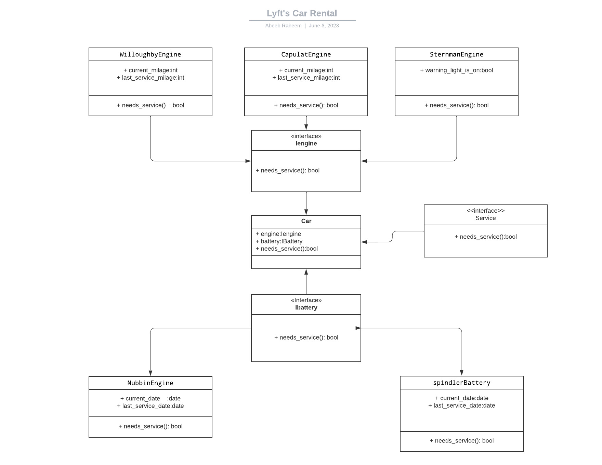

# Lyft Rentals

Lyft Rentals provides vehicles for riders who are looking to rent a vehicle for personal use such as a weekend vacation.

## Project summary

- Come up with a clean design for an existing, unfinished component
- Refactor a [messy codebase](https://github.com/belovetech/forage-lyft/tree/main)
- rite unit tests for your newly refactored system
- Add new functionality to your system using Test-Driven Development

## Criteria for car servicing and car models

## Engine

| engine            | Criteria                              |
| ----------------- | ------------------------------------- |
| apulet Engine     | Once every 30,000 miles               |
| Willoughby Engine | Once every 60,000 miles               |
| Sternman Engine   | Only when the warning indicator is on |

## Battery

| Battery          | Criteria           |
| ---------------- | ------------------ |
| Spindler Battery | Once every 2 years |
| Nubbin Battery   | Once every 4 years |

## Tire

| Tire           | Criteria                    |
| -------------- | --------------------------- |
| Carrigan Tire  | One of the Tire wear => 0.9 |
| Octoprime Tire | Sum of the tire wear >= 3.0 |

## Car Models

| Car        | Engine            | Battery          | Tire           |
| ---------- | ----------------- | ---------------- | -------------- |
| Calliope   | Capulet Engine    | Spindler Battery | Carrigan Tire  |
| Glissade   | Willoughby Engine | Spindler Battery | Octoprime Tire |
| Palindrome | Sternman Engine   | Spindler Battery | Carrigan Tire  |
| Rorschach  | Capulet Engine    | Nubbin Battery   | Octoprime Tire |
| Thovex     | Capulet Engine    | Nubbin Battery   | Carrigan Tire  |

### System architecture UML after refactoring

